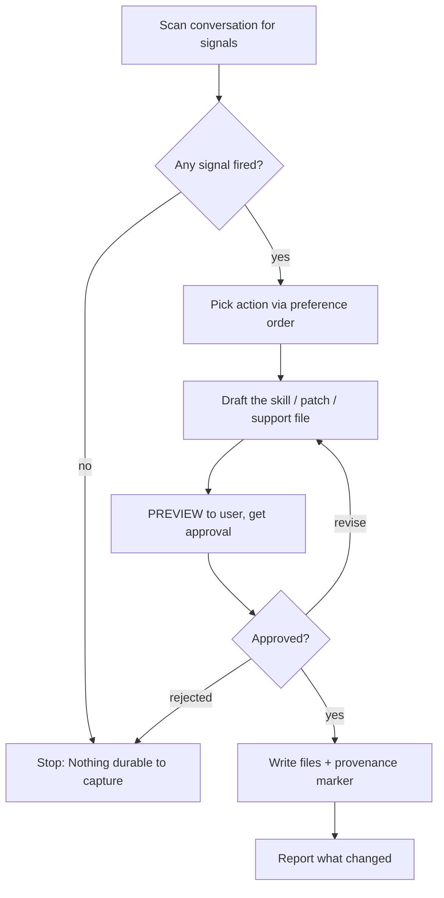

# Self-Evolved

## Overview

Turn what you just learned in this session into durable, reusable skills so the next session starts already knowing it. There is no automatic background process — when the user asks, **you are the reviewer**, running in the foreground over the conversation you just had.

**Core principle:** A review that captures nothing is usually a missed learning opportunity, not a neutral outcome. Be actively biased toward capturing — but never invent learnings, and never capture the traps below.

## When to Use

**ONLY when the user explicitly asks.** Triggers: "evolve yourself", "self-evolve", "what did you learn", "remember this for next time", "capture that as a skill", "update your skills".

**Never** run this automatically, after every turn, or as a side effect of finishing a task. It writes to the user's GLOBAL skill library — it must be requested.

## Skill Library Mechanics

**REQUIRED SUB-SKILL:** Use superpowers:managing-skill-library for the mechanics — scanning the global Claude-compatible skills directory (NOT local project space), reading existing skills, and patching them with general tools. That skill owns *where skills live* (`~/.claude/skills/<name>/SKILL.md`, plus `references/` · `templates/` · `scripts/` support files). This skill governs **what** to capture and **when**.

## Workflow



### 1. Scan for signals

Any ONE of these warrants action:

| Signal | What to capture |
|---|---|
| User corrected your style, tone, format, verbosity ("stop doing X", "too verbose", "just give me the answer", "you always do Y") | Embed the preference into the governing skill so the next session starts knowing it. First-class signal, not just memory. |
| User corrected your workflow, approach, or sequence | Encode the correction as an explicit step or pitfall in the skill for that class of task. |
| A non-trivial technique, fix, workaround, or tool-usage pattern emerged | Capture the reusable method (not the one-off narrative). |
| A skill you loaded this session was wrong, missing a step, or outdated | Patch it now. |

### 2. Pick action — preference order (earliest that fits wins)

1. **Patch a skill already loaded this session** — if it covers the new learning, extend it.
2. **Patch an existing umbrella skill** — list/read existing skills; add a subsection, pitfall, or broadened trigger.
3. **Add a support file** under an existing skill — `references/<topic>.md` (session detail, quirks, condensed docs), `templates/<name>` (copy-and-modify starters), `scripts/<name>` (re-runnable actions). Add a one-line pointer to it from the umbrella's SKILL.md.
4. **Create a new class-level skill** — only when nothing above fits.

### 3. Class-level naming (for new skills)

The name MUST describe a **class** of work, verb-first, hyphenated. It must NOT encode today's task: no PR numbers, error strings, feature codenames, library-only names, or `fix-X` / `debug-Y-today` artifacts. If the name only makes sense for today's task, it's wrong — fall back to (1), (2), or (3).

✅ `handling-api-retries`, `concise-diff-summaries` ❌ `fix-payments-retry`, `q3-incident-summary`

### 4. Draft using a valid skill shape

New `SKILL.md` minimum:
```markdown
---
name: <hyphenated-class-level-name>
description: Use when <triggering conditions only — NOT a workflow summary>
---
<!-- self-evolved: created <YYYY-MM-DD> · session: <one-line context> -->

# <Name>
## Overview
## When to Use
## <Pattern / Steps / Reference>
## Common Mistakes
```
For patches, show a focused diff of the section you're adding/changing.

### 5. Preview, then approve (REQUIRED)

Before writing anything, show the user: the **action** (create/patch/support-file), the **target path**, and the **full content** (or diff for a patch). Write only after explicit approval. Revise on feedback. This is a hard gate — global skill writes are never silent.

### 6. Write & mark provenance

Write the file(s) to `~/.claude/skills/<name>/`. Every agent-created skill gets the `<!-- self-evolved: created ... -->` marker so the user can later find and prune skills this loop generated.

### 7. Report

State plainly what changed, e.g. `Self-evolved: created skill 'handling-api-retries'` or `patched 'systematic-debugging'` or `Nothing durable to capture.`

## Do NOT Capture (these harden into constraints that bite later)

| Trap | Why it's excluded |
|---|---|
| Environment-dependent failures (`command not found`, missing binary, unconfigured creds, fresh-container errors) | The user fixes these; they are not durable rules. Capture the FIX under a setup skill if anything, never "this failed." |
| Negative claims about tools ("the profiler is broken", "X doesn't work") | These harden into self-imposed refusals the agent cites for months after the issue is fixed. Don't capture; verify instead. |
| One-off task narratives ("summarize this PDF", "analyze today's report") | Not a class of work. No skill. |
| Standard, well-documented practice (exponential backoff, basic git) | Already known. Skill adds nothing. |
| Transient errors that resolved before the session ended | If a retry worked, the lesson (if any) is the retry pattern, not the failure. |
| Project-specific facts (this repo's quirks, paths, conventions) | These belong in that project's CLAUDE.md / AGENTS.md, not the global skill namespace. |

## Common Mistakes

| Mistake | Reality |
|---|---|
| Defaulting to "Nothing to save" when a real correction occurred | Inaction on a fired signal is the failure. If the user corrected your style/workflow, that IS durable — capture it. |
| Writing the skill without previewing | Hard gate. Preview and get approval first, always. |
| Creating a new skill when an existing one covers it | Follow the preference order — patch before you create. |
| Naming the skill after today's task | Use a class-level name or fall back to a patch/support file. |
| Capturing a tool failure as "this tool is broken" | Capture the fix, or capture nothing. Never a permanent negative claim. |
| Running this unprompted | Only on explicit request. |

## Red Flags — STOP

- About to write to `~/.claude/skills` without showing the user first → preview first.
- About to record "X doesn't work" or "command not found" → that's a trap, skip it.
- Proposed name only makes sense for today's task → fall back to patch/support file.
- Triggering this without being asked → don't.
