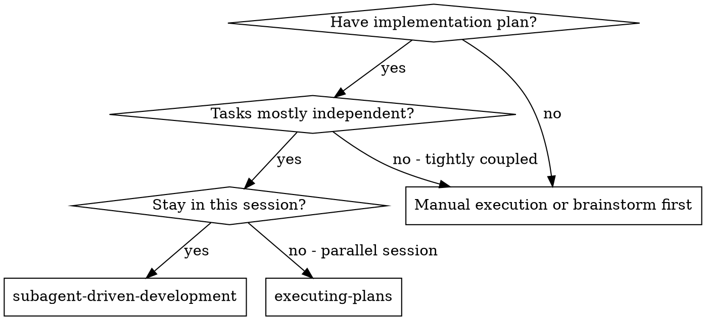
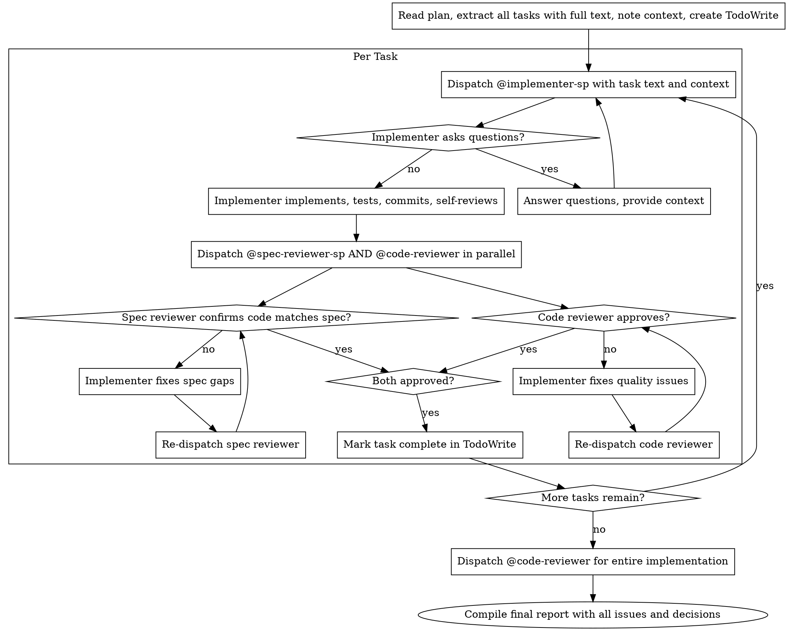

# Subagent-Driven Development

Execute plan by dispatching fresh subagent per task, with parallel two-stage review after each: dispatch spec compliance reviewer and code quality reviewer simultaneously.

**Why subagents:** You delegate tasks to specialized agents with isolated context. By precisely crafting their instructions and context, you ensure they stay focused and succeed at their task. They should never inherit your session's context or history — you construct exactly what they need. This also preserves your own context for coordination work.

**Core principle:** Fresh subagent per task + parallel two-stage review (spec and quality simultaneously) = high quality, fast iteration

## When to Use



**vs. Executing Plans (parallel session):**
- Same session (no context switch)
- Fresh subagent per task (no context pollution)
- Parallel two-stage review after each task: spec compliance and code quality dispatched simultaneously
- Faster iteration (no human-in-loop between tasks)

## The Process



**If subagent asks questions:**
- Escalate to the human with recommended approaches
- Provide additional context if needed
- Don't rush them into implementation

**If reviewer finds issues:**
- Escalate to the human with recommended approaches
- Provide human selected decision to Implementer (same subagent) fixes them
- Re-dispatch the reviewer that found issues (or both if fixes are substantial)
- Repeat until both reviewers approve
- Don't skip the re-review
- Document every issue and decision in the final report — implementer questions, reviewer findings, human decisions, and all fixes applied. The final report must be a complete record.

**If subagent fails task:**
- Dispatch fix subagent with specific instructions
- Don't try to fix manually (context pollution)


## Model Selection

Use the least powerful model that can handle each role to conserve cost and increase speed.

**Mechanical implementation tasks** (isolated functions, clear specs, 1-2 files): use a fast, cheap model. Most implementation tasks are mechanical when the plan is well-specified.

**Integration and judgment tasks** (multi-file coordination, pattern matching, debugging): use a standard model.

**Architecture, design, and review tasks**: use the most capable available model.

**Task complexity signals:**
- Touches 1-2 files with a complete spec → cheap model
- Touches multiple files with integration concerns → standard model
- Requires design judgment or broad codebase understanding → most capable model

## Handling Implementer Status

Implementer subagents report one of four statuses. Handle each appropriately:

**DONE:** Proceed to spec compliance review.

**DONE_WITH_CONCERNS:** The implementer completed the work but flagged doubts. Read the concerns before proceeding. If the concerns are about correctness or scope, address them before review. If they're observations (e.g., "this file is getting large"), note them and proceed to review.

**NEEDS_CONTEXT:** The implementer needs information that wasn't provided. Provide the missing context and re-dispatch.

**BLOCKED:** The implementer cannot complete the task. Assess the blocker:
1. If it's a context problem, provide more context and re-dispatch with the same model
2. If the task requires more reasoning, re-dispatch with a more capable model
3. If the task is too large, break it into smaller pieces
4. If the plan itself is wrong, escalate to the human

**Never** ignore an escalation or force the same model to retry without changes. If the implementer said it's stuck, something needs to change.

## Prompt Templates

When running in OpenCode, use the dedicated agents registered by the superpowers plugin:

| Agent | Role |
|-------|------|
| `@implementer-sp` | Writes code, tests |
| `@spec-reviewer-sp` | Verifies implementation matches spec |
| `@code-reviewer` | Deep code review |


## Prompt Templates (Claude Code / Codex fallback)

If named agents are not available (e.g. in Claude Code or Codex), use the prompt templates:
- `./implementer-prompt.md` - Dispatch implementer subagent
- `./spec-reviewer-prompt.md` - Dispatch spec compliance reviewer subagent

## Example Workflow

```
You: I'm using Subagent-Driven Development to execute this plan.

[Read plan file once: docs/plans/feature-plan.md]
[Extract all 5 tasks with full text and context]
[Create TodoWrite with all tasks]

Task 1: Hook installation script

[Get Task 1 text and context (already extracted)]
[Dispatch @implementer-sp with full task text + context]

Implementer: "Before I begin - should the hook be installed at user or system level?"

You: "User level (~/.config/superpowers/hooks/)"

Implementer: "Got it. Implementing now..."
[Later] Implementer:
  - Implemented install-hook command
  - Added tests, 5/5 passing
  - Self-review: Found I missed --force flag, added it
  - Committed

[Dispatch @spec-reviewer-sp and @code-reviewer in parallel]
Spec reviewer: ✅ Spec compliant - all requirements met, nothing extra
Code reviewer: Strengths: Good test coverage, clean. Issues: None. Approved.

[Mark Task 1 complete]

Task 2: Recovery modes

[Get Task 2 text and context (already extracted)]
[Dispatch @implementer-sp with full task text + context]

Implementer: [No questions, proceeds]
Implementer:
  - Added verify/repair modes
  - 8/8 tests passing
  - Self-review: All good
  - Committed

[Dispatch @spec-reviewer-sp and @code-reviewer in parallel]
Spec reviewer: ❌ Issues:
  - Missing: Progress reporting (spec says "report every 100 items")
  - Extra: Added --json flag (not requested)
Code reviewer: Strengths: Solid. Issues (Important): Magic number (100)

[Implementer fixes all issues]
Implementer: Removed --json flag, added progress reporting, extracted PROGRESS_INTERVAL constant

[Re-dispatch both reviewers in parallel]
Spec reviewer: ✅ Spec compliant now
Code reviewer: ✅ Approved

[Mark Task 2 complete]

...

[After all tasks]
[Dispatch @code-reviewer for entire implementation]
Final reviewer: All requirements met, ready to merge

[Compile final report with all issues and decisions from implementers and reviewers]

Final Report:
- Task 1 (Hook installation):
  - Implementer question: System or user level? → Decision: User level
  - Implementer self-review: Added --force flag (originally missing)
  - Spec review: ✅ No issues
  - Code review: ✅ No issues
- Task 2 (Recovery modes):
  - Spec review: ❌ Missing progress reporting, extra --json flag
  - Code review: ❌ Magic number 100
  - Fixes applied: Added PROGRESS_INTERVAL constant, removed --json flag, added progress reporting per 100 items
  - Spec re-review: ✅ Fixed
  - Code re-review: ✅ Fixed
- Task 3-5: (similar per-task entries)
- Final code review: ✅ All requirements met, ready to merge

Done!
```

## Advantages

**vs. Manual execution:**
- Subagents follow TDD naturally
- Fresh context per task (no confusion)
- Parallel-safe (subagents don't interfere)
- Subagent can ask questions (before AND during work)

**vs. Executing Plans:**
- Same session (no handoff)
- Continuous progress (no waiting)
- Review checkpoints automatic

**Efficiency gains:**
- No file reading overhead (controller provides full text)
- Controller curates exactly what context is needed
- Subagent gets complete information upfront
- Questions surfaced before work begins (not after)

**Quality gates:**
- Self-review catches issues before handoff
- Parallel two-stage review: spec compliance and code quality reviewed simultaneously
- Review loops ensure fixes actually work
- Spec compliance prevents over/under-building
- Code quality ensures implementation is well-built
- Final report captures all issues and decisions from implementers and reviewers for complete traceability

**Cost:**
- More subagent invocations (implementer + 2 reviewers per task)
- Reviewers dispatched in parallel (faster wall-clock time, same total invocations)
- Controller does more prep work (extracting all tasks upfront)
- Review loops add iterations
- But catches issues early (cheaper than debugging later)

## Red Flags

**Never:**
- Start implementation on main/master branch without explicit user consent
- Skip reviews (spec compliance OR code quality)
- Proceed with unfixed issues
- Dispatch multiple implementation subagents in parallel (conflicts)
- Make subagent read plan file (provide full text instead)
- Skip scene-setting context (subagent needs to understand where task fits)
- Ignore subagent questions (answer before letting them proceed)
- Accept "close enough" on spec compliance (spec reviewer found issues = not done)
- Skip review loops (reviewer found issues = implementer fixes = review again)
- Let implementer self-review replace actual review (both are needed)
- Move to next task while either review has open issues
- Re-dispatch only one reviewer when fixes substantially change the implementation (both need fresh eyes)

## Integration

**Required workflow skills:**
- **superpowers:using-git-worktrees** - REQUIRED: Set up isolated workspace before starting
- **superpowers:writing-plans** - Creates the plan this skill executes
- **superpowers:requesting-code-review** - Code review template for reviewer subagents

** Subagent @implementer-sp should use:
- **superpowers:behavior-guidelines** - REQUIRED

** Subagent @code-reviewer should use:
- **superpowers:code-review-expert** - REQUIRED

**Subagents should use:**
- **superpowers:test-driven-development** - Subagents follow TDD for each task

**Alternative workflow:**
- **superpowers:executing-plans** - Use for parallel session instead of same-session execution
